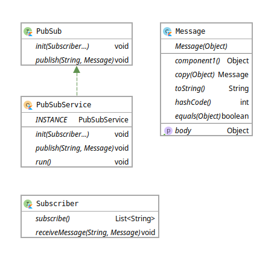

# Challenge

> [original readme](./README_ORIGINAL.md)

# Solução

Para solucionar o problema do desafio pensando em flexibilizar e escalar as regras de negócio com baixo acoplamento foi implementado uma arquitetura baseada em eventos com o padrão Publisher-Subscriber.

## Padrão Publisher-Subscriber


*Publisher-Subscriber Pattern <Fonte: https://aws.amazon.com/pt/pub-sub-messaging/>*

Este padrão permite que a aplicação anuncie eventos (Publishers) para vários consumidores (Subscribers) de seu interesse assincronamente, sem acoplar os remetentes aos destinatários.

## Implementação do padrão no desafio



*UML Básica da implementação do padrão <Fonte: Gerado pelo IntelliJ>*

A classe `PubSubService` é o principal serviço que faz a comunicação entre os os publicadores de eventos e os seus consumidores, como um broker de mensagem.

O registro dos interessados em consumir eventos ocorre via  `PubSubService.init(Subscriber...)`

A aplicação `ChallengeApplication.kt` configura todos os consumidores:

```kotlin
PubSubService.init(
    EmailNotificationCreatedSubscriber(),
    OrderCreatedSubscriber(),
    OrderItemBookCreatedSubscriber(),
    OrderItemDigitalCreatedSubscriber(),
    OrderItemMembershipCreatedSubscriber(),
    OrderItemPhysicalCreatedSubscriber()
)
```

Foi criado o método `Order.process()` onde é feita a primeira publicação de eventos após ocorrer todo o pagamento:

- O serviço de eventos:
  1. recebe um tópico e uma mensagem
  2. O serviço de eventos emite a mensagem para os consumidores registrados para ouvir o tópico `ORDER_CREATED`

```kotlin
order.process { invoice, items ->
    PubSubService.publish(Topics.ORDER_CREATED.name, Message(OrderCreated(invoice, items)))
}
```

> **PS:** Toda a comunicação é feita assincronamente evitando bloqueio entre publicadores e consumidores, e onde os mesmos não se conhecem

As outras emissões de eventos acontece mediante consumo da última publicação citada, onde desencadeia *N* outros eventos.

**Log da aplicação em execução**

```sh
[Apr 15, 2019 1:15:36 AM] INFO [OrderCreatedSubscriber.receiveMessage                       ]: #12 msg=order received, order=challenge.model.Order@4cb58e23
[Apr 15, 2019 1:15:36 AM] INFO [OrderCreatedSubscriber.publishItems                         ]: #13 msg=sending order item, order=11dd97ce-99a8-4b26-a8e4-df3534bd335a, item=Familiar plan type=MEMBERSHIP
[Apr 15, 2019 1:15:36 AM] INFO [OrderCreatedSubscriber.publishItems                         ]: #14 msg=sending order item, order=11dd97ce-99a8-4b26-a8e4-df3534bd335a, item=Stairway to Heaven type=DIGITAL
[Apr 15, 2019 1:15:36 AM] INFO [OrderCreatedSubscriber.publishItems                         ]: #12 msg=sending order item, order=11dd97ce-99a8-4b26-a8e4-df3534bd335a, item=The Hitchhiker's Guide to the Galaxy type=BOOK
[Apr 15, 2019 1:15:36 AM] INFO [OrderCreatedSubscriber.publishItems                         ]: #15 msg=sending order item, order=11dd97ce-99a8-4b26-a8e4-df3534bd335a, item=Flowered t-shirt type=PHYSICAL
[Apr 15, 2019 1:15:36 AM] INFO [OrderItemMembershipCreatedSubscriber.receiveMessage         ]: #16 msg=activating subscription, order=11dd97ce-99a8-4b26-a8e4-df3534bd335a, customer=Bob Alice, item=Familiar plan
[Apr 15, 2019 1:15:36 AM] INFO [OrderItemMembershipCreatedSubscriber.notifyCustomerByEmail  ]: #16 msg=sending email, order=11dd97ce-99a8-4b26-a8e4-df3534bd335a, customer=bob@alice.com, item=Familiar plan
[Apr 15, 2019 1:15:36 AM] INFO [OrderItemBookCreatedSubscriber.receiveMessage               ]: #12 msg=generating a shipping label with tax free, order=11dd97ce-99a8-4b26-a8e4-df3534bd335a, item=The Hitchhiker's Guide to the Galaxy
[Apr 15, 2019 1:15:36 AM] INFO [OrderItemDigitalCreatedSubscriber.generatePromotionalCode   ]: #17 msg=generating promotional code associated with customer, email=bob@alice.com, code=ab739
[Apr 15, 2019 1:15:36 AM] INFO [OrderItemPhysicalCreatedSubscriber.receiveMessage           ]: #12 msg=generating a shipping label, order=11dd97ce-99a8-4b26-a8e4-df3534bd335a, item=Flowered t-shirt
[Apr 15, 2019 1:15:36 AM] INFO [EmailNotificationCreatedSubscriber.receiveMessage           ]: #16 msg=email was successfully sent, recipient=bob@alice.com, subject=Your account has been activated body=Congratulations Bob Alice, your account has been successfully activated!
[Apr 15, 2019 1:15:36 AM] INFO [OrderItemDigitalCreatedSubscriber.notifyCustomerByEmail     ]: #17 msg=sending email, order=11dd97ce-99a8-4b26-a8e4-df3534bd335a, customer=bob@alice.com, item=Stairway to Heaven
[Apr 15, 2019 1:15:36 AM] INFO [EmailNotificationCreatedSubscriber.receiveMessage           ]: #12 msg=email was successfully sent, recipient=bob@alice.com, subject=Your order 11dd97ce-99a8-4b26-a8e4-df3534bd335a has been paid successfully body=Save with this promotional code ab739 valid in 2019 on next purchase. Download now and enjoy your product: Stairway to Heaven.
```

## Evoluindo a aplicação para uma arquitetura de microserviços

Com esse padrão implementado a evolução para uma arquitetura baseada em microserviços fica mais trivial, onde o desacoplamento já não é tão doloroso.

O próximo passo a ser feito é criar uma nova implementação da interface `PubSub` que utiliza um broker de mensageria externo a aplicação como um *Rabbit* ou *Apache Kafka*.

Depois é iniciar a extração dos consumidores para aplicações independentes, onde pode ser escalada individualmente de acordo com sua necessidade e profundidade de sua fila/tópico.

O processo evolutivo final seria semelhante a imagem abaixo:


*Publisher-Subscriber Pattern <Fonte: https://docs.microsoft.com/pt-br/azure/architecture/patterns/publisher-subscriber>*